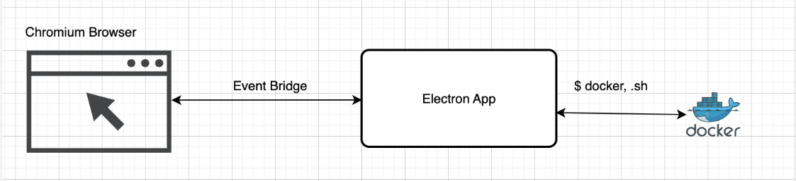

# Design Considerations

## Architecture

DockerVPC is developed using ElectronJS + ReactJS, interacting with docker via shell commands/scripts.

### Why ReactJS?
ReactJS was not preferred initially, since it could introduce unused functionalities and therefore additional bloat to the project. Since I was interested in only basic UI rendering functionality in the beginning, there was an attempt ([Reactron](https://github.com/Jordan-Ng/reactron) - my naive implementation of react rendering library for electron) to implement a similar UI rendering engine, but as the project feature grew, Reactron was not able to support the growing requirements and it became increasingly hard to maintain both DockerVPC and debug Reactron at the same time. 

As a result, ReactJS was ultimately chosen because it's a framework I was familiar with at the time, and I wanted to spend more time developing DockerVPC features.

### Why ElectronJS?
For portability! One of the project milestones involve having this project be portable between machines (windows, linux). Since ElectronJS ships with a chromium browser, it's easily portable between machines without major code restructuring/refactoring (macOS uses colima to host a linux VM for docker, so shell commands will only need to be tweaked slightly for a linux machine).

### Why Containers?
Docker containers are chosen to be spun up instead of VMs (i.e virtualbox) for latency concerns. 
provisioning and managing VMs require alot more overhead, as it requires full virtualization. Containers on the other hand share the host OS kernel, making them lightweight and faster to spin up.

>#### Using containers to provision EC2 instances is not consistent with AWS offerings
>DockerVPC aims to provide an AWS-like environment, and not a 1-1 mapping of the offerings. Since latency is of greater concern in a local development setup, containers are chosen as the virtualization technique, and the GUI will make developers "feel" like they are provisioning a VM

>#### What about Security Concerns?
>This project is ultimately aimed for local development, and is therefore **not suitable for production use**. That being said, everything is root and/or run with sudo privileges without any checks to ensure better interoperability. Now would it be hackable? yea definitely. But it's your own machine, so hack away!